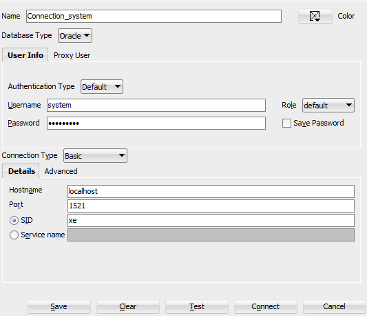

# Oracle PL/SQL

Curso tomado de **Udemy** del tutor de **Apasoft Training**

## Oracle Live SQL en vez de Sql Developer

https://livesql.oracle.com/apex/f?p=590:1000

## Instalación de Usuario HR en Oracle 11g

Si trabajamos con la base de datos `Oracle 11g`, el usuario `HR` viene dentro de la instalación de la base de datos, así que para poder tenerlo disponible lo único que necesitamos hacer es desbloquearlo y asignarle una constraseña.

Crearemos una conexión desde SQL Developer con el usuario `system` y la contraseña será la que definimos al instalar la Base de datos de Oracle. 
Veamos los datos de conexión:



Ahora, usando la conexión del usuario `system`, ejecutaremos las siguientes consultas para desbloquear al usuario `hr` y asignarle una contraseña **(la pass que le asignemos es KeySensitive):**

````sql
ALTER USER hr ACCOUNT UNLOCK;
ALTER USER hr IDENTIFIED BY hr;
````

## Conexión al usuario SYSTEM en Oracle 21c

Para crear una conexión al usuario `system` en `Oracle 21c` debemos usar el `Service name: XEPDB1` en reemplazo del **SID: xe** que usábamos en versiones anteriores como en **Oracle 11g**:


## Instalación de Usuario HR en Oracle 21c

En esta versión de `Oracle 21c` el usuario `HR` no viene en la instalación de la base de datos. Para tenerlo disponible necesitamos descargarlo y habilitarlo de otra manera. 

Para habilitar el `schema hr` debemos descargarlo de [github de oracle](https://github.com/oracle-samples/db-sample-schemas/releases/tag/v21.1) y luego proceder a instalar de la siguiente manera.

1. Descromprimimos el empaquetado y nos ubicamos mediante la terminal en el directorio `/human_resources`
2. Nos conectamos usando `sqlplus` y seguimos los siguientes pasos como se muestra en la imagen:

    ```bash
    $ sqlplus sys/magadiflo@localhost:1521/xepdb1 as sysdba
    SQL> show con_name
    SQL> @hr_main.sql

    password hr: hr
    default tablespace for HR: users
    temporary tablespace for HR: temp
    password for SYS: magadiflo
    log path: C:\oracle\oracle_database_21c_ex\dbhomeXE\demo\schema\log
    connect string: localhost:1521/xepdb1
    ```

    > **NOTA**, el `log path` utiliza el directorio `\log` que está dentro de los archivos de instalación de `SQL Developer`

    

3. Cuando demos enter en la última instrucción de la imagen anterior, veremos lo siguiente:

    ````bash
    SP2-0310: unable to open file "__SUB__CWD__/human_resources/hr_cre.sql"
    SP2-0310: unable to open file "__SUB__CWD__/human_resources/hr_popul.sql"
    SP2-0310: unable to open file "__SUB__CWD__/human_resources/hr_idx.sql"
    SP2-0310: unable to open file "__SUB__CWD__/human_resources/hr_code.sql"
    SP2-0310: unable to open file "__SUB__CWD__/human_resources/hr_comnt.sql"
    SP2-0310: unable to open file "__SUB__CWD__/human_resources/hr_analz.sql"
    ````

4. Es importante el orden en el que nos mostró los archivos anteriores pues los iremos ejecutando uno por uno en ese mismo orden agregándole el `@` delante del nombre del archivo:

    ````bash
    SQL> @hr_cre.sql
    SQL> @hr_popul.sql
    SQL> @hr_idx.sql
    SQL> @hr_code.sql
    SQL> @hr_comnt.sql
    SQL> @hr_analz.sql
    ````

5. Al finalizar la ejecución del último archivo podremos ver si el usuario `HR` fue instalado correctamente tal como se muestra en la imagen:

    

6. Podemos abrir nuestro esquema, en este caso usaré `DBeaver`:

    
    

## Esquema Hr


